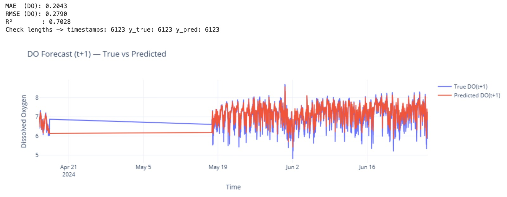
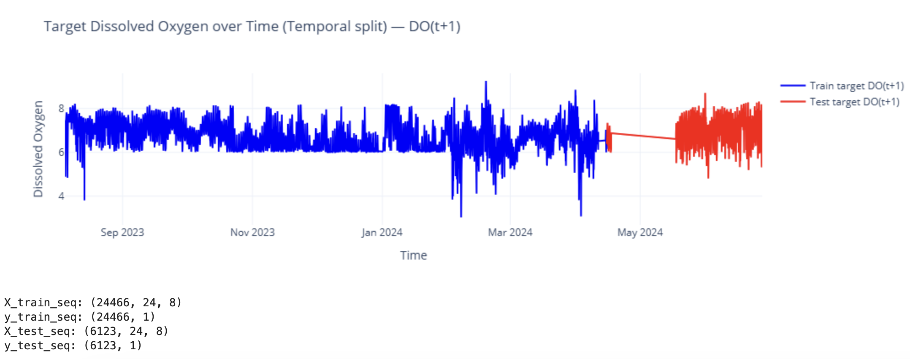

# Water Quality Forecasting using LSTM

This project applies a Long Short-Term Memory (LSTM) neural network to forecast water quality time-series data, with a focus on predicting Dissolved Oxygen (DO).

---

## 📌 Project Overview

The workflow includes:

- Data cleaning and preprocessing  
- Handling missing values using interpolation  
- Time-series sequence generation  
- Training an LSTM model using TensorFlow/Keras  
- Forecasting Dissolved Oxygen (DO)  
- Model evaluation using MAE, RMSE, and R²  

---

## 🎯 Target Variable

- Dissolved Oxygen (DO)

---

## 📊 Results

### 🔹 Actual vs Predicted DO Forecast

---

### 🔹 Train/Test Temporal Split

---

### 🔹 Preprocessing (Interpolation)

Before-and-after interpolation plots are available here:

[View Interpolation Results](results/before_after_interpolation_plots.pdf)

---

## 🛠 Technical Details

- Sequence length: 24 timesteps  
- Model: LSTM (TensorFlow/Keras)  
- Features used: Multiple water quality parameters  
- Data split: Temporal (train → past, test → future)  

---

## 📈 Model Performance

- MAE: 0.2043  
- RMSE: 0.2790  
- R²: 0.7028  

---

## 📁 Repository Structure

---

## ⚠️ Notes

- Dataset is not included in this repository  
- Update dataset path in notebook before running  

---

## 🚀 How to Run

1. Install dependencies  
2. Open the notebook  
3. Update dataset path  
4. Run all cells  

---
